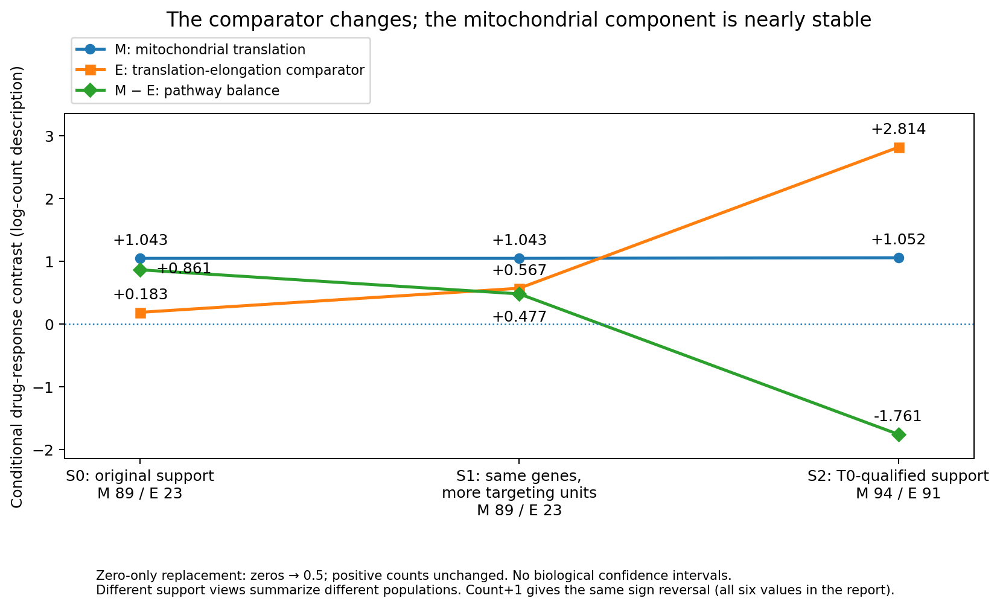
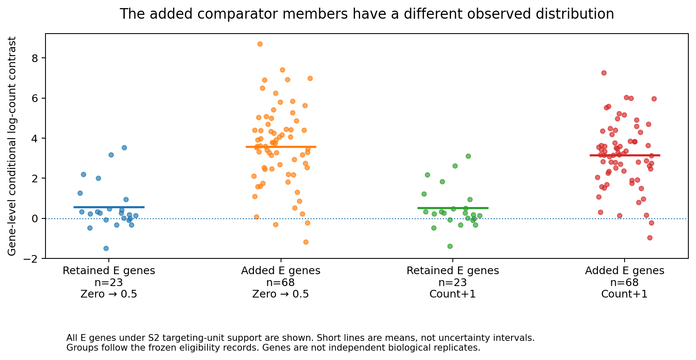
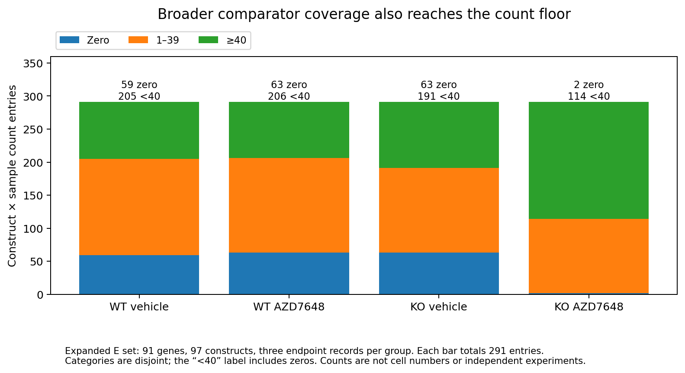

# Comparator membership changes a pathway contrast in a DNA-PK inhibitor screen

**DDR TargetBridge · Computational functional-genomics case study**

Portfolio release 3.0 · 25 September 2026 · Public-data secondary analysis

## Research question
Can a pathway-prioritization argument retain its direction when the genes and annotation-defined targeting units included in the comparison change under fixed rules?

## Why this question matters
Pooled screens measure relative representation, not necessarily absolute survival. A pathway name can conceal unequal member coverage. Before interpreting a positive contrast as a reason to prioritize a process, the analyzed population must be explicit. This case tests that issue in one archived experiment, not a general selection theory. [1–3]

## Approach and principal finding
We compared fixed Reactome sets for Mitochondrial translation (M) and Eukaryotic Translation Elongation (E) in an A549 WT/PRDX1-KO × vehicle/AZD7648 screen. Three pre-existing support views separated changes in targeting-unit support from addition of genes. Under zero-only replacement, the conditional M−E contrast was +0.861, +0.477 and −1.761. Count+1 produced the same sign reversal.

**The mitochondrial component was approximately stable; the comparator changed.** Its conditional component increased from +0.183 to +0.567 to +2.814 as targeting units and genes entered E. Expanded coverage also included many low-count observations, so neither support view can be designated the biological truth.

## Decision
Do not use the original positive balance as a membership-insensitive justification for a mitochondrial-specific priority from this archive. The opposite sign does not justify prioritizing E instead. This is a completed local evidence-use case, not a new mechanism, calibrated decision system, or clinical result.

## Contribution and attribution
The project contributes an explicit empirical comparison, component decomposition and executable source-table/count-export record. Original investigators generated all laboratory data. AI assisted scientific discussion, coding, testing, figures and writing. Individual unaided authorship is not inferred from the artifact; the responsibility boundary is documented separately. [4]

<!-- PAGEBREAK -->

## 1. Evidence and analysis population
The primary analysis begins with the existing complete integer-count export: **64,237 physical constructs and 16 real sample records**. Four endpoint groups each contain three culture records; each background also has two real T0 records. The source study reports an A549 dual-guide CRISPRi experiment with 625 nM AZD7648 over 11 days. Background, knockout-clone establishment and other cell-line features are not independently separated by this comparison. [1,4]

A dual-guide cassette is one physical reagent. Annotation-defined gene/transcript targeting units are not measurements of RNA abundance or isoform-specific knockdown. Multiple such units are averaged within gene under the frozen hierarchy. The main analysis does not select the strongest guide or most favourable transcript after seeing its drug result.

| View | Gene membership | Targeting-unit support | M / E genes |
|---|---|---|---|
| S0 | Original supported genes | Original qualified units | 89 / 23 |
| S1 | Same genes as S0 | All T0-qualified units for those genes | 89 / 23 |
| S2 | All T0-qualified genes | All T0-qualified units | 94 / 91 |

The full pathway definitions contain 137 M and 99 E members. E is the exact Reactome Eukaryotic Translation Elongation set (R-HSA-156842), not a synonym for all cytosolic translation. M is R-HSA-5368287. Machine files retain the older label C for E; no numerical identifiers were changed.

All views retain exact identity and unique physical-mapping requirements. T0 qualification requires a mean raw count of at least 40 over the two real T0 records in each background. S0 also requires mean terminal vehicle counts of at least 40 in both backgrounds. The threshold concerns a group mean, not every individual count. S1 and S2 remove that terminal-vehicle criterion for their respective permitted units; missing designs and identity ambiguity are not imputed.

### Estimand
Counts are transformed by either (i) replacing only zeros with 0.5 and taking log2, or (ii) adding 1 to every count and taking log2. Both use the same 1,024 NTC identities for sample centering. Construct values are averaged within targeting unit, units within gene, and genes within the supported pathway. For pathway P:

**β(P,b) = mean drug(P,b) − mean vehicle(P,b)**

**θ(P) = β(P,KO) − β(P,WT); θ(balance) = θ(M) − θ(E).**

A shared additive sample centre cancels from M−E. That algebra does not cancel gene-specific effects, count floors or changed membership. The values are relative log-count descriptors, not absolute cell numbers or survival effects.

<!-- PAGEBREAK -->

## 2. The comparator, not the mitochondrial arm, drives the reversal

**Figure 1.** Frozen component values under zero-only replacement. The three curves disclose the two arms and their difference; lines join alternative analysis views, not timepoints. No biological confidence interval is implied. Full-precision source: `results/canonical/support_views/decision_grid.tsv`.

| Transformation | View | θ(M) | θ(E) | θ(M−E) |
|---|---|---:|---:|---:|
| Zero → 0.5 | S0 | +1.043 | +0.183 | +0.861 |
| Zero → 0.5 | S1 | +1.043 | +0.567 | +0.477 |
| Zero → 0.5 | S2 | +1.052 | +2.814 | −1.761 |
| Count+1 | S0 | +1.040 | +0.186 | +0.854 |
| Count+1 | S1 | +1.040 | +0.522 | +0.518 |
| Count+1 | S2 | +1.045 | +2.482 | −1.437 |

S0→S1 leaves the M component unchanged while E increases. Five retained E genes acquire additional annotation-defined targeting-unit support: EEF2, RPL13A, RPS29, RPS3 and UBA52. This is not a measured change in expressed isoforms. S1→S2 changes M by about +0.009 and E by about +2.247 under zero-only replacement. These are sequential arithmetic differences, not causal fractions of a biological or technical effect.

<!-- PAGEBREAK -->

## 3. The retained and added comparator genes are different observed populations

**Figure 2.** Every E gene under S2 targeting-unit support, partitioned by the frozen eligibility record. Points are genes, not independent experimental replicates. Short horizontal marks are arithmetic means, not error bars. Source: `revision/results/revision/retained_added_gene_values.tsv`.

Under zero-only replacement, the 23 retained E genes have a mean conditional component of +0.567; the 68 added genes have a mean of +3.574. The S2 component is their weighted mixture:

**θ(E,S2) = (23/91) × 0.566563 + (68/91) × 3.574051 = 2.813917.**

The added E genes make up about three quarters of the expanded E population. The same decomposition under count+1 gives an added-member mean of +3.144 and a combined component of +2.482. The five added M genes shift their component much less. All original directory members, including unsupported entries, remain in the membership table.

This disclosure establishes the arithmetic driver of the finite contrast, not that any added subgroup is a therapeutic target. It also explains why fixed gene names alone do not guarantee a fixed estimate: S0 and S1 retain the same genes but average different targeting-unit support. The original threshold and both transformations remain unchanged.

<!-- PAGEBREAK -->

## 4. Broader coverage has a measurement cost

**Figure 3.** Expanded E contains 97 physical constructs representing 91 genes. Three endpoint records per group produce 291 construct×sample entries per bar. Zero, 1–39 and ≥40 categories are disjoint; the displayed “<40” totals include zeros. No entries were deleted for this figure. Source: `results/canonical/support_views/count_floor.tsv`.

Restoring coverage does not establish a less biased estimate of a single latent pathway effect. S2 includes 59/291 zeros in WT vehicle, 63/291 in WT drug, 63/291 in KO vehicle and 2/291 in KO drug. The expanded E vehicle-to-T0 description is −5.051 in WT and −5.637 in KO; KO drug-minus-vehicle is +2.952. Relative enrichment can coexist with substantial prior relative depletion.

Eligibility and response also share observations. For an illustrative construct, selection contains **I(mean vehicle ≥40)** while response contains **mean drug − mean vehicle**. Not looking at drug counts during selection does not make selection independent of the response. Removing the criterion changes both biological composition and measurement precision. This archive does not identify the magnitude or direction of a causal selection bias.

Reduced accumulation of negative selection, count-floor effects, composition changes and treatment-specific interaction remain compatible explanations. Existing growth-aware methods motivate this caution, but no fitted growth correction or residual-based mechanism is introduced here. [2,3]

<!-- PAGEBREAK -->

## 5. What the individual samples show—and do not show

**Figure 4a–b.** All 16 real records under each view using zero-only replacement. The same samples are reused across views; T0 has two records per background, and each endpoint has three. Points are culture records, not independent clones. Count+1 values remain in the complete source table. Source: `results/canonical/support_views/pathway_sample_values.tsv`.

The archived member deletions and 81 joint endpoint-omission configurations retain each view’s sign. These are local influence checks on repeated use of the same observations. They do not resolve clone effects, perturbation efficacy or biological population uncertainty. No bootstrap of genes, omission-based confidence interval or post-hoc significance threshold is presented.

<!-- PAGEBREAK -->

## 6. Interpretation, limits and project contribution
The direct finding is specific: **a relative pathway comparison changes direction when comparator targeting-unit and gene support change, while the M arm stays approximately stable.** The data support rejecting a membership-insensitive interpretation of the original positive contrast. They do not support treating the expanded negative result as an opposite mechanism or a better therapeutic target.

This is not a calibrated pharmaceutical GO/NO-GO system. A fixed sign is a historical descriptive criterion, not a measured threshold for therapeutic value or development cost. The case makes no claim about patient benefit, therapeutic window, drug occupancy or the proportion of a biological effect caused by selection.

### What is new here
Public experiments and standard methods already establish that context, growth and measurement affect screening. The project does not own those ideas or the parent mechanisms. It adds the exact source linkage and adverse comparisons in this archive, and the quantified component/support diagnosis above. The implementation is a reusable research record with source-specific parsers and fixed analyses, not a general-purpose production platform. [1–5]

### Separate histories, not a causal chain
An earlier PRKDC nomination analysis retained only 12 of 36 source-called partners. Preferential ordering was not stable across its two evaluated settings; it did not establish failure of the complete rule. A later fixed repair-versus-metabolism crossing required a positive olaparib contrast and a negative AZD1775 contrast. The R2 values were +0.324207 and +0.154191, so that exact crossing failed. It was post-discovery and historically exposed, not an untouched prospective test.

These results remain fully accessible in the contextual supplement. Neither is explained causally by the present M/E analysis. Parent γH2AX/iron experiments concern selected source-study reagents; SUM trajectories concern a different programme. They illustrate measurement limits, not sequential or orthogonal validation of the complete M/E comparison.

### Ownership
All original laboratory experiments belong to the cited source investigators. The project delivers secondary analysis, evidence organization, explicit failure decisions and reproducible code with AI assistance. The human owner’s unaided contribution to each component is not established by these artifacts. Named role declarations and public licensing remain a human responsibility; no institution, publication, DOI or employment endorsement is invented. [4]

<!-- PAGEBREAK -->

## 7. Reproducibility and availability
The release supports distinct reproduction layers. Each opens fixed inputs and writes to a fresh output directory; no accepted table, threshold or failed criterion is overwritten.

| Layer | Runnable scope |
|---|---|
| Source CSV/XLSX → PRKDC linkage and matching | Exact published source labels, panel construction and inherited matching |
| R2 workbook → full background → fixed crossing | 99,294 records: values, genes, targeting annotations and worksheet rows |
| Complete integer-count export → terminal result | All ten fixed tables plus component and mixture checks |
| Accepted result tables → presentation | Main figures and current documents |
| Fresh HDF5 or FASTQ → all historical results | Not established and not claimed |

The scientific implementations and their original input hashes are retained. Verification receipts record the tested environment. File hashes establish identity; numerical agreement establishes calculation parity; neither creates biological replication. This release reruns documented numerical paths after repository restructuring, not a new scientific analysis. Methods, exact entry points, provenance and the full claim ledger accompany the report.

### Finish line
**PROJECT SCIENTIFICALLY FROZEN FOR PORTFOLIO USE.** Current evidence is sufficient to finish this bounded case study. No additional dataset, model, pathway, significance test or candidate search is introduced to change the result. A future broader biological claim would require genuinely discriminating evidence and a separately defined study; it is not necessary to complete this portfolio.

## References and internal evidence
[1] O’Loughlin et al. Chemogenomic maps reveal a PRDX1-dependent iron–damage axis in the DNA damage response. Nature Chemical Biology (2026). DOI: 10.1038/s41589-026-02312-z. Original experiments and parent mechanisms.

[2] Colic et al. Identifying chemogenetic interactions from CRISPR screens with drugZ. Genome Medicine (2019). DOI: 10.1186/s13073-019-0665-3. Prior methodological context, not a new method used to optimize these results.

[3] Hafner et al. Growth rate inhibition metrics correct for confounders in measuring sensitivity to cancer drugs. Nature Methods (2016). DOI: 10.1038/nmeth.3853. Growth-rate context; this project did not compute GR metrics.

[4] DDR TargetBridge V2, original user-supplied archives; exact file hashes in `provenance/V2_ARCHIVE_CATALOG.tsv`. This release’s claim IDs CL01–CL10 resolve in `docs/SCIENTIFIC_CLAIM_LEDGER.json`.

[5] Fielden et al. Comprehensive interrogation of synthetic lethality in the DNA damage response. Nature (2025). DOI: 10.1038/s41586-025-08815-4. Source of the separate historical genetic nominations.
