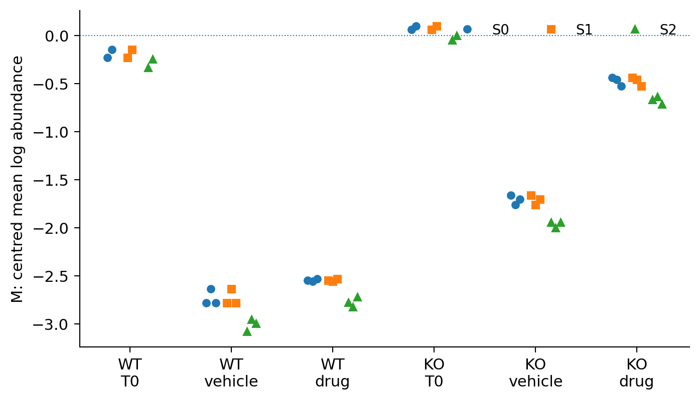
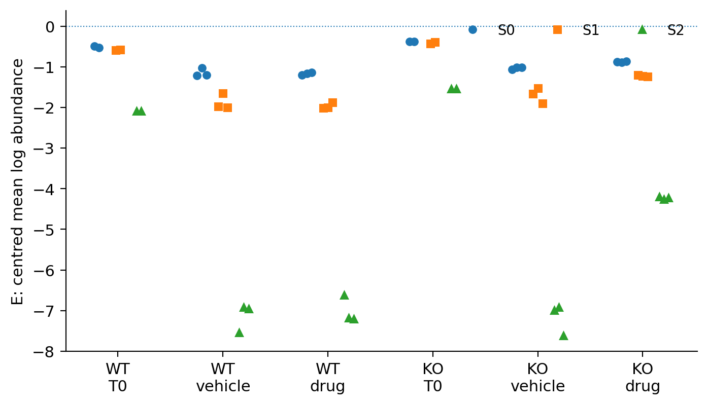

# Separate case histories and measurement illustrations

**Companion to the completed DDR TargetBridge case study.** These histories are not sequential validation of the main M/E comparison. Full original tables and frozen code remain available; no unfavourable cases have been removed.

## 1. PRKDC source nominations and conditional drug support
The source contains 547 PRKDC partner labels: 36 meet the original GEMINI sensitive≤−1 threshold, and 511 do not. The primary panel contains 12 and 368, respectively. Only one third of source calls reaches the comparison. Engineered-mismatch labels and missing records cannot be recast as biological failures. Source-not-called records can be comparators for a priority rule without being known biological negatives.

Within this finite panel, A=0.7022 in R2 and 0.5236 in R3; inherited matching gives 0.6000 and 0.4833. Matching reuses 45 distinct comparators across 58 case-control pairs with equal total case weight. It shares vehicle information with the response and does not estimate a causal fraction explained. The original no-escalation decision concerns the evaluated records and conditions, not the complete rule or DNA-PK biology.

All twelve cases, all omitted calls, identities, source scores and matched pairs are in `results/extended/original_rule/` and `data/historical_sources/expected/`. R2 and R3 raw-score magnitudes must not be compared on a supposed common drug-effect scale. After the exact external files are retrieved, the source CSV/XLSX workflow reproduces panel construction and matching; complete raw-sequencing replay is not claimed.

## 2. The fixed crossed-order hypothesis
HAP1.L2.32 contains nine repair-related genes and HAP1.L2.139 ten mixed-metabolism genes. The exact full background and member lists are preserved in `revision/data/crossover/`. R2 olaparib and AZD1775 give repair-minus-metabolism T contrasts of +0.324207 and +0.154191. The predefined crossing required the second value to be negative, so the crossing failed.

This is a post-discovery, historically exposed, cross-context comparison. NALM-6 knockout/CRANKS and A549 CRISPRi/rho differ in background, modality, treatment and scoring. A shared compound name and gene list do not make them equivalent. A positive difference between two positive contrasts cannot rescue the historical two-sign criterion. The fixed R2 vectors can now be regenerated from the exact workbook before ranking; they are not reconstructed from rounded figure values.

## 3. What the broader discovery contributes
The original 75×1,416 discovery census and all supporting, missing and heterogeneous records are retained in the original V2 archives. They document the search space and how later questions arose. They are not 106,200 independent experiments or a validation population for the terminal M/E result. The complete historical census is not distributed in this smaller public tree; the original private V2 archive and its catalog preserve it. Public result summaries do not substitute for that census.

## 4. Parent assays: do not exchange measurement scales
The parent laboratory produced the γH2AX, competition, FerroOrange/ATP and stress-intervention experiments. This project bound and summarized their supplied values. For a reagent-specific normalization y_r=100 F_r/b_r, unknown b_r prevents direct raw-fluorescence comparisons across reagents. Within-reagent ratios cancel a denominator only if it is fixed and shared; a ratio of means does not reconstruct paired raw ratios when replicate normalization differs. The source data do not prove those denominators are equal.

All supplied reagents, including WRAP53, are retained. Lower normalized endpoint values, lower drug-induced increments and weakened interactions are distinct statements. FerroOrange/ATP is not iron per cell without the underlying components and cell-number information. These analyses do not negate the parent’s separate experiments or validate our entire pathway comparison.

Sources and all retained values: `revision/data/context/`, `data/derived/parent_Fig5d_normalized_values.tsv` and `results/canonical/readout_boundaries/`. Full parent factorial tables remain in the original archive.

## 5. SUM time course and reference centres
The SUM149PT olaparib programme is a different cell context, drug and study. Relative enrichment over control can coexist with a decline relative to pretreatment. If A=drug−pretreatment and B=control−pretreatment, then D=A−B is an algebraic relation, not three independent evidence layers. Calendar time is not population doublings. Relative guide abundance does not determine absolute survival.

Common additive reporter centres cancel from a fixed within-sample M−E balance by construction. Their cancellation is not independent biological robustness evidence. Where module or gene levels depend on centering, all reporter-family and branch differences remain. No favourable SUM branch was selected to validate the DNA-PK result.

## 6. Local influence and computational checks
Member deletion, 81 overlapping joint endpoint omissions, fixed transforms, hashes and repeated numerical implementations protect specific computational statements. None supplies an additional clone, experiment or intervention-efficacy measurement. Main-report values are traceable to exact tables, and accepted tables are not overwritten when reproduction runs.

The originally blocked Wilson mismatch design and rejected narrow A model remain different historical statuses. A missing designed-variant map is a resource block, not a biological negative. A rejected contribution scope is not a failed scientific effect. Both are documented in `docs/decision_history.md` without making an audit log the biological story.

## Supplementary Figure S1: individual sample records

**Figure S1 | Individual pathway/sample observations.** All 16 actual sample identities are shown under each support view using zero-only replacement. Each background has two real T0 records and three records per endpoint group. Support views reuse the same observations, and sample points are not independent clones. Values under count+1 remain in the complete canonical table. M denotes mitochondrial translation; E is the fixed translation-elongation comparator. Source: `results/canonical/support_views/pathway_sample_values.tsv`.
